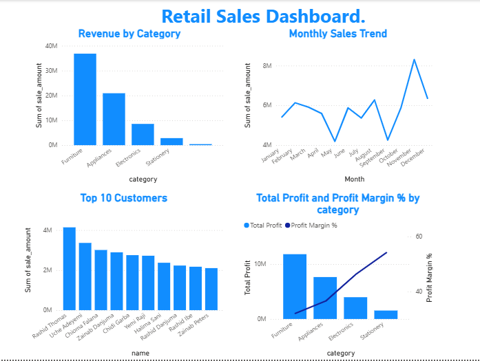

## Power BI Dashboard

The same analysis, visualised as an interactive Power BI dashboard:

The dashboard presents all five business questions at a glance — revenue by category, the monthly sales trend, top customers, and the key revenue-vs-margin finding: the highest-revenue category (Furniture) has the lowest profit margin. Built in Power BI Desktop from the same dataset, using table relationships and calculated measures (Total Profit, Profit Margin %) that mirror the SQL logic.
